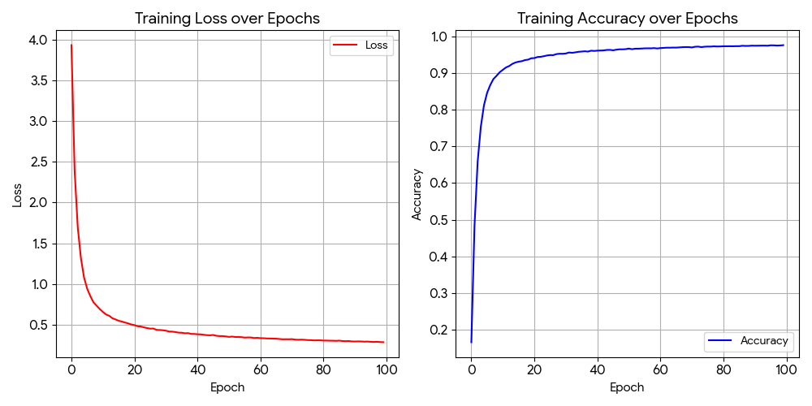

# SimCLR Paper Reproduction(2020)

## Introduction
This project reproduces the SimCLR as described in the original paper.

## Architecture Summary
Component,Layer / Block,Configuration / Parameters,Output Shape
Encoder,Input,"shape=(224, 224, 3)","[B, 224, 224, 3]"
,Conv2D,"Filters: 64, Kernel: 7x7, Strides: 2, Padding: ""same""","[B, 112, 112, 64]"
,BatchNormalization,-,"[B, 112, 112, 64]"
,ReLU,-,"[B, 112, 112, 64]"
,MaxPool2D,"Pool Size: 3x3, Strides: 2, Padding: ""same""","[B, 56, 56, 64]"
,3x ResNetBlock,out_dims=256,"[B, 56, 56, 256]"
,1x ResNetBlock,"out_dims=512, downsample=True","[B, 28, 28, 512]"
,3x ResNetBlock,out_dims=512,"[B, 28, 28, 512]"
,1x ResNetBlock,"out_dims=1024, downsample=True","[B, 14, 14, 1024]"
,5x ResNetBlock,out_dims=1024,"[B, 14, 14, 1024]"
,1x ResNetBlock,"out_dims=2048, downsample=True","[B, 7, 7, 2048]"
,2x ResNetBlock,out_dims=2048,"[B, 7, 7, 2048]"
,GlobalAveragePooling2D,-,"[B, 2048]"
Projection Head,Input,"shape=(2048,)","[B, 2048]"
,Dense,"Units: 2048, use_bias=False","[B, 2048]"
,BatchNormalization,-,"[B, 2048]"
,ReLU,-,"[B, 2048]"
,Dense (Output),Units: 128,"[B, 128]"

## Dataset
tiny-imagenet-200 is used as the dataset in this reproduction. The images are augmented with the techniques in the original paper (cropping and colour distortion). The purpose of this reproduction is to check if our model successfully extracted useful features from images, not predicting other images. So, we don't fine-tune it further for other prediction tasks.

## Results
We train SimCLR for 100 epochs

| Metric                         | Value |
| -------------------------------| ----- |
| Pre-training Top-1 accuracy    | 97.55% |

The training loss and Top-1 accuracy for 100 epochs for SimCLR is below

## Discussion
From the result, it can be found that our model has extracted important features of images. With further fine-tuning, it is expected that our model can be used for predicting other images. Compared with Max-ViT and other supervised learning models we implemented earlier, self-supervised learning focuses more on loss function and argumentation, instead of architecture. SimCLR focuses on how to teach the model to distinguish the differences within a negative pair. 
### Future work
We only compare images within a batch and the images within a batch never change. If we can also compare images across different batches, we can have more different pairs and increase data efficiency. Moreover, we can also shuffle images after each epoch, which makes images within a batch differ.

## References
Chen, T., Kornblith, S., Norouzi, M., & Hinton, G. (2020). A simple framework for contrastive learning of visual representations. In Proceedings of the 37th International Conference on Machine Learning (pp. 1597–1607). PMLR.

Tiny ImageNet Dataset
Wu, J., Zhang, J., Xie, Y., & others. (2017).
Tiny ImageNet Visual Recognition Challenge.
Stanford University.
https://tiny-imagenet.herokuapp.com/
